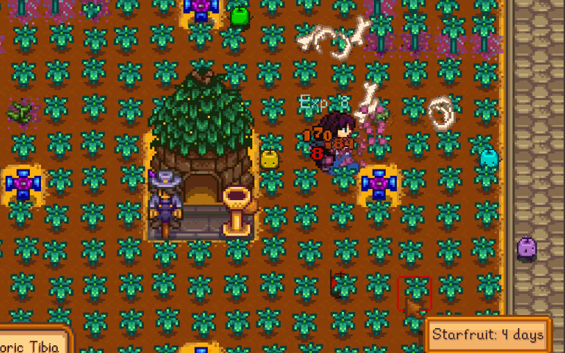

Farm Combat Grants XP Too
==========================

This mod is mostly deprecated. In 1.6, monsters now award 1/3 of xp if killed on farm, and quests can allow monsters on farm to count.

~~In vanilla, when you kill a monster on the farm, you get no XP from it; nor does it count towards quests. This mod makes it so you do.~~

**NOTE: THE XP NUMBERS ARE FROM [UI INFO SUITE 2](https://github.com/Annosz/UIInfoSuite2/releases). THIS MOD DOES NOT ADD XP NUMBERS, IT JUST RESTORES THE ABILITY TO GET XP ON THE FARM.**

### Install

1. Install the latest version of [SMAPI](https://smapi.io).
2. Download this mod and unzip it into `Stardew Valley/Mods`.
3. Run the game using SMAPI.

### Config options
Run SMAPI at least once with this mod installed to generate the `config.json`, or use [Generic Mod Config Menu](https://www.nexusmods.com/stardewvalley/mods/5098) to configure.

* `GainExp` restores XP gain from monster kills on farm.
* `QuestCompletion` counts monster kills on farm towards billboard quest completion.
* `SpecialOrderCompletion` counts monster kills on farm towards special order objectives.

### Compatibility

* Works with Stardew Valley 1.5.6 on Linux/macOS/Windows.
* Works in single player, multiplayer, and split-screen mode. Can probably be installed by just one player in multiplayer.

### See Also:

* [Release Notes](docs/CHANGELOG.MD)

Requires SMAPI, uses harmony.
