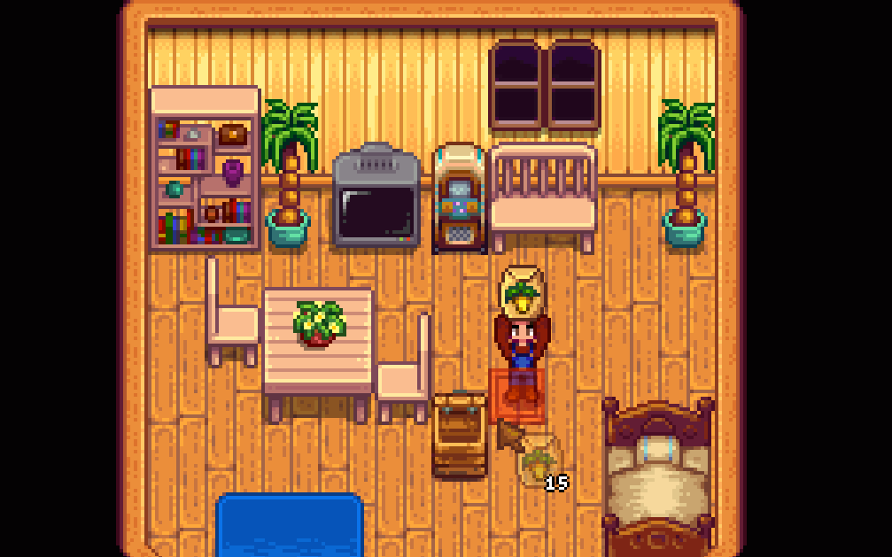

Less Mini Shipping Bin
======================

Lets you set the capacity of the mini shipping bin higher.

### Install

1. Install the latest version of [SMAPI](https://smapi.io).
2. Download this mod and unzip it into `Stardew Valley/Mods`.
3. Run the game using SMAPI.

### Compatibility
1. Works with Stardew Valley 1.5.6 on Linux/macOS/Windows.
2. Works in single player, multiplayer, and split-screen mode. In multiplayer, probably best if everyone installs the mod.

### See also

[Changelog](docs/changelog.md)
