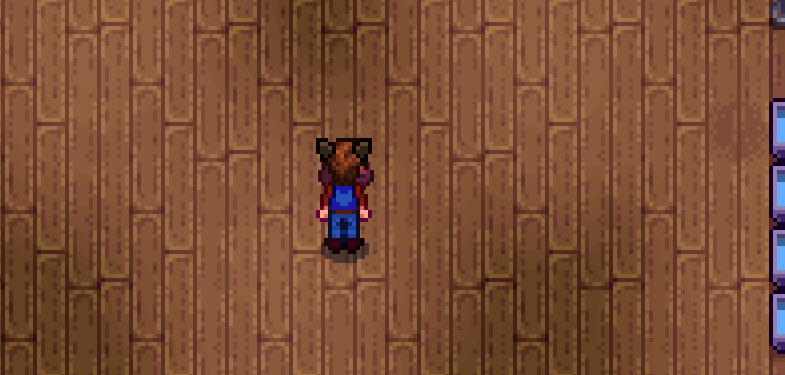

Prismatic Slime
=================================

Makes that prismatic slime not a one-time encounter. Lets you raise them in the slime hutch. Gives the Prismatic Jelly a few more usages.

This is my Pride 2022 mod. But wait, atra, you may say, it's like...2023? And I say: yes. I know. I'm very late.

## Install

1. Install the latest version of [SMAPI](https://smapi.io).
2. Download and install [AtraCore](https://www.nexusmods.com/stardewvalley/mods/12932).
2. Download this mod and unzip it into `Stardew Valley/Mods`.
3. Run the game using SMAPI.

## Compatibility

* Works with Stardew Valley 1.5.6 on Linux/macOS/Windows.
* Works in single player, multiplayer, and split-screen mode.
* Should be compatible with most other mods. 

## See also

* [Changelog](docs/Changelog.md)
